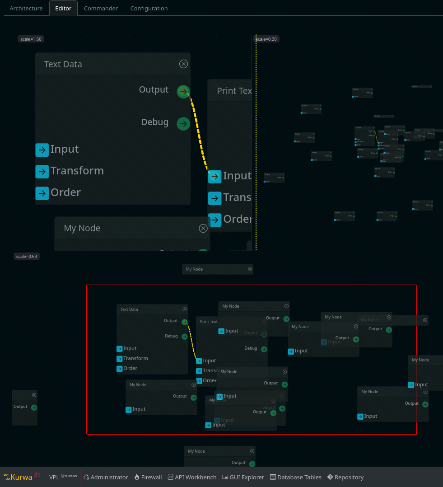

# Kurwa (Curves) - A Visual Programming Language



This is the initial release, the database is still under construction,
a great deal of work is needed for the UI, but the geometry work is mostly OK.

## TLDR;

- Requires a desktop display, mobile is too small for serious work.

## Rebuilding Database

rm database.db
npm run migration
npm run seed

## Developing

Once you've created a project and installed dependencies with `npm install` (or `pnpm install` or `yarn`), start a development server:

```bash
npm run dev

# or start the server and open the app in a new browser tab
npm run dev -- --open
```

## Building

To create a production version of your app:

```bash
npm run build
```

You can preview the production build with `npm run preview`.

> To deploy your app, you may need to install an [adapter](https://kit.svelte.dev/docs/adapters) for your target environment.

## News

Upgrades To Svelte @latest

## TODO

    + security patch: lodash omit for .owner and .id
    + parent needs edges data for the two test nodes
    + pullable needs work, get it upgraded and clean
    + make edges work with database version of nodes
    + next steps, create/save new nodes by dblclicks
    + and then, add the enter node feature for edits
